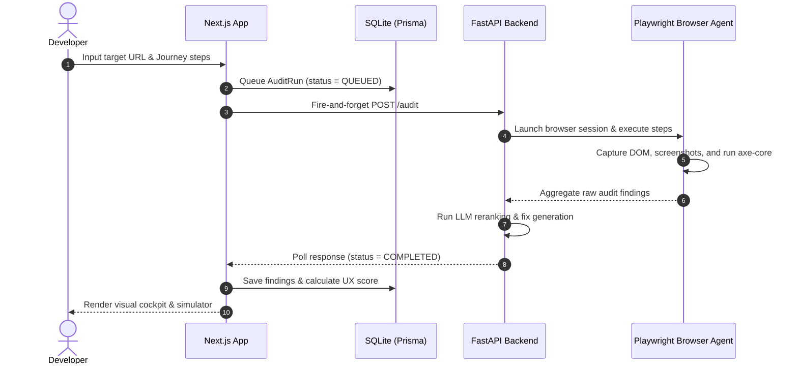

# ⚖️ UX-Auditor

<p align="center">
  <strong>Dual-engine UX & accessibility auditing with interactive fix simulation and PR-ready remediation plans.</strong>
</p>

<p align="center">
  
  
  
  
  
  
</p>

---

## 🚀 Why UX-Auditor?

Most auditing tools stop at telling you *what* is broken. UX-Auditor is built to bridge the gap between audit findings and code remediation. By combining **automated WCAG validation** with **conversational AI agents** and **interactive score simulation**, UX-Auditor helps developers identify, simulate, and export code changes directly.

- **Dual-Engine Precision**: Combines deterministic rules (axe-core) with advanced AI vision model heuristics to evaluate both code compliance and page design layout quality.
- **User Journey Agent**: Runs an autonomous browser agent (`browser-use`) to navigate live pages based on user-defined steps (e.g., *"click pricing, select Sign Up, test the form"*).
- **Remediation Cockpit**: Interactive simulator to preview code patches, visualize estimated score lifts, and review before/after visual highlights side-by-side.
- **PR-Ready Exports**: Generates branch suggestions and directly exports remediation PRs to your GitHub repository.
- **Judge Mode Reports**: Instantly generates a clean, stakeholder-ready executive summary with business impacts and accessibility risk breakdowns.

---

## 🛠️ Architecture & Data Flow

UX-Auditor separates state management (Next.js & Prisma DB) from execution logic (FastAPI & Playwright) to guarantee stateless, fast, and scalable background runs.



---

## ✨ Key Features

### 1. Dual-Engine Audit
- **Deterministic**: Injects axe-core checks to locate missing form labels, contrast failures, and broken ARIA markers.
- **AI Usability Heuristics**: Applies custom layout checks and vision analysis to evaluate visual hierarchy, CTA size, and mobile responsiveness.

### 2. User Journey Steps
- Instructs the AI browser agent to traverse interactive paths, verifying usability hurdles at each step of the user funnel.

### 3. Before/After Fix Simulator
- Toggle proposed code suggestions.
- Real-time score recalculation showing estimated improvement lifts before you modify your repo.

### 4. Judge Mode Executive Summary
- Premium light-themed dashboard displaying a UX health verdict, risk profiles, business impacts, and polished narrative summaries ready for stakeholder presentations.

### 5. 🔊 Voice Summary (Accessibility)
- **Listen to Audit Summary**: One-click AI-narrated audio playback of audit findings, powered by [Smallest.ai](https://smallest.ai) TTS.
- Converts score, top risks, and highest-impact fixes into a concise spoken summary — ideal for visually impaired users or hands-free review.
- Fully server-side: API keys are never exposed to the client.

---

## 📂 Directory Structure

```
UX-Auditor/
├── src/
│   ├── app/                    # Next.js App Router (pages & API endpoints)
│   │   ├── api/
│   │   │   ├── audit/          # Submissions, logs, and chat endpoints
│   │   │   └── auth/           # NextAuth handler configuration
│   │   ├── audit/[id]/         # Main audit dashboard & Judge Mode
│   │   ├── dashboard/          # User audit history and projects
│   │   └── page.tsx            # Main landing page
│   ├── components/ui/          # Shared layout and badge components
│   ├── lib/                    # Server-side service layers and DB helpers
│   └── types/                  # TypeScript interface definitions
├── server/                     # Python FastAPI Backend
│   ├── main.py                 # FastAPI endpoints & dashboard uvicorn configuration
│   ├── auditor.py              # browser-use agent & axe-core runner
│   ├── heuristics.py           # Custom layout analysis rules
│   └── llm_layer.py            # AI vision processing & fix generators
├── prisma/
│   └── schema.prisma           # Database schema (SQLite)
└── package.json                # Project script definitions & npm modules
```

---

## ⚙️ Setup & Installation

### Prerequisites
- **Node.js** $\ge$ 18
- **Python** $\ge$ 3.10
- **Git**

### 1. Clone & Install Frontend
```powershell
git clone https://github.com/Sarasbari/UX-Auditor.git
cd UX-Auditor
npm install
```

### 2. Configure Environment Variables
Create a `.env` file in the root directory:
```env
DATABASE_URL="file:./dev.db"
OPENAI_API_KEY="your-openai-api-key"
NEXTAUTH_SECRET="generate-a-random-base64-string"
NEXTAUTH_URL="http://localhost:3000"

# Optional: GitHub OAuth integration
GITHUB_ID=""
GITHUB_SECRET=""

# Optional: Smallest.ai Voice Summary (enables "Listen" button)
SMALLEST_AI_API_KEY=""
SMALLEST_AI_VOICE_ID="meher"
SMALLEST_AI_MODEL="lightning_v3.1"
```

### 3. Database Initialization
Generate the Prisma Client and push the schema to SQLite:
```powershell
npm run db:setup
```

### 4. Setup Python Backend
Set up a virtual environment and download dependencies:
```powershell
cd server
python -m venv .venv
.venv\Scripts\activate
pip install -r requirements.txt
playwright install chromium
deactivate
cd ..
```

---

## 🏃 Run Locally

Start both the FastAPI backend (port `8001`) and the Next.js dev server (port `3000`) using the orchestrator:

```powershell
npm run dev:all
```
Open **[http://localhost:3000](http://localhost:3000)** in your browser to start auditing!

---

## 🛡️ License

This project is licensed under the MIT License — see the [LICENSE](LICENSE) file for details.