# UX-Auditor Agentic Architecture Design Document (AADD) v2.0

This document defines the comprehensive software architecture for the UX-Auditor. It acts as the master engineering blueprint, detailing how the system transitions from a hybrid rule/LLM API system to an autonomous, event-driven agentic platform.

---

# Part I — Vision

## 1. Executive Summary

### Why UX-Auditor Exists
Traditional web development workflows lack automated quality assurance for User Experience (UX) and design fidelity. While unit tests cover logic and compiler checks ensure structural integrity, the actual visual appearance and usability of web interfaces are left to subjective human reviews, leading to critical UI regression, poor accessibility, and inconsistent layouts in production.

### Why Current Audit Tools Fail
Existing automated tools like `axe-core` or Lighthouse are strictly rule-based and deterministic. They excel at finding objective HTML failures (e.g., missing `alt` attributes or basic color contrast ratios) but are entirely blind to subjective design flaws:
* They cannot detect visual clutter or lack of alignment.
* They cannot judge hierarchical typography balance.
* They do not understand the contextual placement of calls-to-action (CTAs).
* They cannot verify if an automated patch visually breaks the page.

### Why Agentic AI Changes Everything
Agentic AI moves from static, single-prompt models to an autonomous, goal-oriented system. By integrating browser automation, multi-agent collaboration, self-reflection, and closed-loop verification, UX-Auditor doesn't just list bugs. It acts as an **Autonomous UX Engineer** that:
1. Formulates an execution plan based on the layout's context.
2. Interacts with the interface like a human user (clicking buttons, expanding menus, testing forms).
3. Gathers visual and structural evidence.
4. Generates precise code modifications (patches) to solve design issues.
5. Deploys and visually verifies the patch in a sandboxed browser environment before delivering the report.

---

## 2. Design Philosophy

Our agentic system is designed around seven core principles:

1. **AI as an Operating System Capability**: LLMs are treated not as simple chatbots, but as reasoning engines orchestrating OS resources (browsers, filesystem, and external build chains).
2. **Mission-Driven Architecture**: Every execution is modeled as a distinct "Mission" with a clear goal, bound by resource budgets (token limit, execution time, and execution depth).
3. **Autonomous Decision Making**: Agents decide *how* to achieve their subgoals based on real-time feedback, rather than following hardcoded execution trees.
4. **Evidence over Prompts**: Every finding must be backed by concrete evidence—a DOM node selector, computed style, structural snapshot, and a highlighted screenshot.
5. **Verification before Generation**: No code fix or recommendation is proposed to the user unless it has been successfully applied, re-rendered, and verified in a sandboxed browser to ensure it doesn't cause regressions.
6. **Human-in-the-loop by Choice**: The system operates autonomously but provides hooks for humans to review steps, override plans, or accept code patches.
7. **Explainability First**: Every agentic decision log and reflection step is recorded, ensuring that the final report explains *why* a correction was made.

---

## 3. System Principles

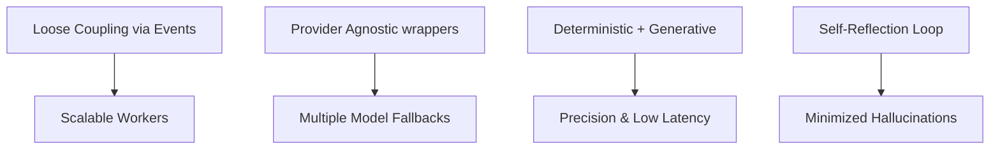

* **Loose Coupling**: Subsystems interact exclusively via an asynchronous Event Bus. The Planner doesn't need to know the internal state of the Browser Agent.
* **Event-Driven**: Events trigger state transitions. For example, a `CAPTURE_COMPLETE` event signals the Analysis Engine to begin processing.
* **Autonomous Agents**: Each agent is designed around a single domain of expertise (e.g., the Patch Agent only does code generation; the Verification Agent only validates patches).
* **Provider-Agnostic AI**: All LLM and VLM interactions are wrapped by a unified translation layer, making it easy to swap between OpenAI, Anthropic, Gemini, or local models.
* **Deterministic + Generative Hybrid**: Use fast, rule-based code for structured validation (contrast math, DOM tree analysis) and generative AI only for subjective reasoning (aesthetics, copywriting, UX flow).
* **Self-Reflection**: Agents evaluate their own output before committing. If the Patch Agent produces invalid syntax, it must self-correct based on compiler logs before reporting failure.
* **Continuous Learning**: Successful patches and design fixes are recorded in long-term memory to inform future audits of the same project.

---

# Part II — Complete Architecture

## 4. High-Level Architecture

The diagram below details the flow of data from the initial user request down to the final report generation:

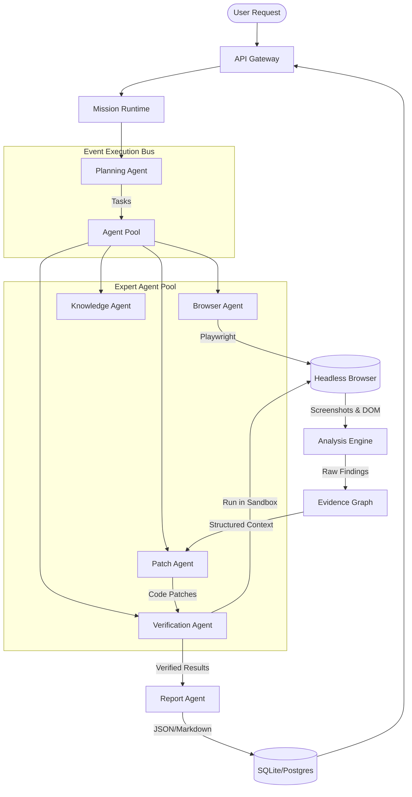

---

## 5. Component Architecture

* **API Gateway / Server**: Receives requests, authenticates users, serves the Next.js frontend, and forwards audit tasks to the Mission Runtime.
* **Mission Runtime**: Manages the lifecycle of active audit tasks, handles the task queue, and ensures recovery if worker processes crash.
* **Planner**: Orchestrates the workflow. It takes an audit goal (e.g., "Audit login flow for screen-reader accessibility") and decomposes it into sequential execution tasks.
* **Execution Bus**: An asynchronous event router that assigns tasks to specific agents and handles communication via events.
* **Browser Agent**: Controls the headless Playwright instance. Responsible for navigating, clicking, capturing DOM snapshots, extracting computed styles, and taking screenshots.
* **Knowledge Agent**: Handles retrieval of context (such as past audits, project-specific styles, or coding guidelines) using RAG (Retrieval-Augmented Generation).
* **Memory Agent**: Manages short-term context during a run and writes key lessons to the long-term project vector database.
* **Patch Agent**: Generates code patches (HTML, CSS, React diffs) to resolve the identified UX and accessibility issues.
* **Verification Agent**: Test-applies the code patches onto the live browser DOM to verify that they resolve the problem and do not break the page layout.
* **Report Agent**: Gathers data from the Evidence Graph and compiles it into an interactive user-facing report.
* **Chat Agent**: Drives the interactive user session, allowing developers to ask follow-up questions, request alternative patches, or request custom audits.

---

## 6. Folder Architecture

```text
ux-auditor/
├── prisma/
│   └── schema.prisma          # Database schema (SQLite / PostgreSQL)
├── src/
│   ├── app/                   # Next.js App Router (UI & API Routes)
│   │   ├── api/
│   │   │   ├── audit/         # Audit lifecycle endpoints
│   │   │   └── auth/          # Authentication handlers
│   │   └── dashboard/         # User reporting dashboard
│   ├── components/            # UI components (shadcn/tailwind)
│   ├── lib/
│   │   ├── auth.ts            # NextAuth Configuration
│   │   ├── prisma.ts          # Database client
│   │   ├── system-wrapper.ts  # Unified AI provider interface
│   │   ├── mission/           # Mission Runtime
│   │   │   ├── queue.ts       # Job queue manager
│   │   │   └── state.ts       # Mission state machine
│   │   ├── planner/           # Planning & task decomposition
│   │   │   ├── agents/        # Specialized Agent modules
│   │   │   │   ├── browser.ts # Playwright control wrapper
│   │   │   │   ├── patch.ts   # Code patch generator
│   │   │   │   ├── verify.ts  # Visual & functional testing
│   │   │   │   └── knowledge.ts # Context & RAG retrieval
│   │   │   └── engines/       # Analysis and heuristic engines
│   │   │       ├── deterministic/ # Axe-core & static CSS checks
│   │   │       ├── llm/       # Vision-Language heuristic prompt
│   │   │       └── merge/     # Finding fusion and scoring
│   └── types/                 # Shared TypeScript interfaces
```

---

# Part III — Mission Runtime

The **Mission Runtime** guarantees fault-tolerant, stateful execution of audits.

## Mission Lifecycle & State Machine

Every audit represents a "Mission". A mission transitions through states based on events:

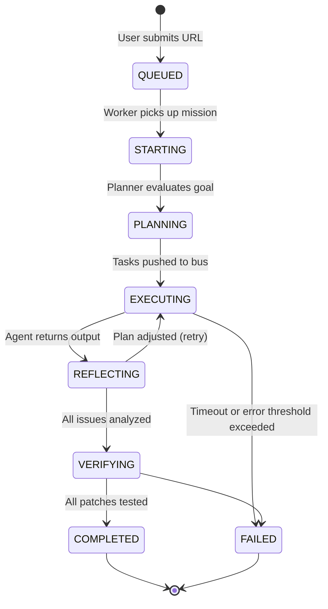

### Core Runtime Components
* **Mission Object**: A JSON document representing the current state, configuration, and variables of the audit run.
* **Mission Queue**: Redis-backed or SQLite-based job queue that guarantees at-least-once delivery of audit tasks to workers.
* **Mission Context**: An isolated in-memory registry storing active page credentials, browser context details, and runtime configurations.
* **Mission Recovery**: A watchdog process that checks for crashed workers. If a worker goes silent for >60 seconds, the watchdog resets its state to `QUEUED` and triggers a re-run.

---

# Part IV — Agent System

Each agent is a specialized, autonomous unit with defined parameters.

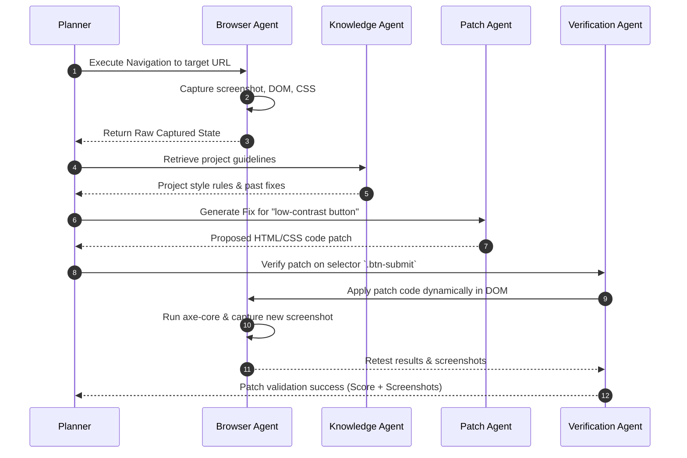

---

## 1. Browser Agent
* **Purpose**: Execute browser actions and capture visual and structural states of the target page.
* **Responsibilities**:
  * Execute safe navigation and handle popups/cookie banners.
  * Retrieve DOM node dimensions, visibility parameters, and computed styles.
  * Capture visual screenshots (viewport and full-page).
* **Inputs**: Target URL, Action script (optional).
* **Outputs**: Raw HTML, Screenshot buffer, Computed styles (up to 300 key elements).
* **Events**: Emits `CAPTURE_COMPLETE`, `NAVIGATION_ERROR`.

## 2. Planning Agent
* **Purpose**: Decompose the user's high-level goal into actionable browser and analysis tasks.
* **Responsibilities**:
  * Analyze URL layout and create a list of interactive pages or states to test.
  * Handle dynamic replanning if page navigations trigger redirects or authentication walls.
* **Inputs**: Main URL, User objectives.
* **Outputs**: Execution Task Graph.

## 3. Knowledge Agent
* **Purpose**: Enrich the reasoning context with project histories, framework rules, and design standards.
* **Responsibilities**:
  * Perform vector search on historical audits to retrieve past code fixes.
  * Identify target frontend frameworks (e.g. Next.js, Tailwind) to tailor code patches.
* **Inputs**: Target URL code snippets, framework signature.
* **Outputs**: Project Context, Design Guidelines.

## 4. Patch Agent
* **Purpose**: Generate code patches to fix identified design or accessibility issues.
* **Responsibilities**:
  * Synthesize context-aware code modifications (e.g. contrast adjustments, missing tags).
  * Format diffs based on the framework detected by the Knowledge Agent.
* **Inputs**: Evidence snippet (DOM/CSS), Issue description.
* **Outputs**: Patch code (diff or DOM modification script).

## 5. Verification Agent
* **Purpose**: Test the validity of code patches in a sandboxed runtime.
* **Responsibilities**:
  * Inject the proposed patch into the Playwright browser DOM.
  * Trigger a re-run of deterministic audits (like `axe-core`) on the patched element.
  * Compare screenshots before and after the patch to ensure no layout regressions occur.
* **Inputs**: Original page state, Element selector, Patch code.
* **Outputs**: Verification status (`success`/`failed`), Patched screenshot, Regressions list.

---

# Part V — Wrapper Runtime

To prevent raw dependency on a single LLM vendor, all cognitive functions are wrapped in a unified wrapper interface (`system` runtime):

```typescript
interface SystemRuntime {
  generate(prompt: string, options?: GenOptions): Promise<string>;
  reason(context: string, question: string): Promise<string>;
  plan(goal: string, steps: string[]): Promise<TaskGraph>;
  embed(text: string): Promise<number[]>;
  verify(code: string, rules: string[]): Promise<{ valid: boolean; errors: string[] }>;
}
```

### Operational Polices
* **Provider Selection**: Dynamic fallback routing. If GPT-4o timeouts or rate-limits, fall back to Claude-Sonnet, Gemini, or a local quantized LLM.
* **Retry Engine**: Exponential backoff with jitter for transient connection errors.
* **Caching Layer**: Cache similar visual evaluation requests using semantic embedding hashes.
* **Cost Optimization**: Auto-truncate HTML DOM context to the nearest 15k characters before vision processing to control token costs.

---

# Part VI — Event Driven Runtime

All components communicate asynchronously via these standardized events on the execution bus:

| Event Name | Producer | Consumers | Payload Schema |
| :--- | :--- | :--- | :--- |
| `MISSION_CREATED` | API Gateway | Mission Runtime | `uuid, url, userId, depth_limit` |
| `MISSION_STARTED` | Mission Runtime | Planning Agent | `uuid, url` |
| `CAPTURE_COMPLETE` | Browser Agent | Analysis Engine | `uuid, screenshot_url, html_ref, styles_ref` |
| `ANALYSIS_COMPLETE` | Analysis Engine | Patch Agent, Planner | `uuid, issues: Issue[]` |
| `PATCH_GENERATED` | Patch Agent | Verification Agent | `uuid, issueId, selector, diff` |
| `PATCH_VERIFIED` | Verification Agent | Planner, Report Agent | `uuid, issueId, status: "success" \| "failed", pre_img, post_img` |
| `REPORT_READY` | Report Agent | Mission Runtime | `uuid, report_id, score, summary` |

---

# Part VII — Analysis Engine

The Analysis Engine handles the ingestion of web page data and filters out actionable design/accessibility findings.

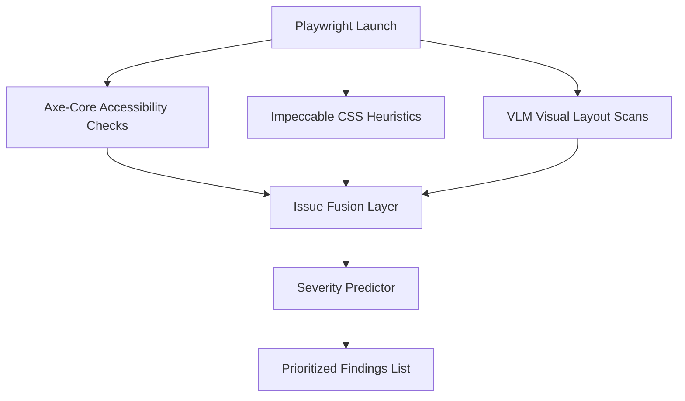

1. **Accessibility Parsing**: Runs `axe-core` inside the browser page to compile WCAG AA/AAA violations.
2. **Computed Style Parsing**: Gathers bounding rectangles and styling declarations (font-family, margins, background colors, contrast ratios) for the top 300 DOM nodes.
3. **Visual Layout Classification**: Passes the viewport screenshot to a vision model (or visual rules engine) to detect design issues like alignment grids, overlap, or excessive whitespace.
4. **Issue Fusion**: Combines overlapping findings (e.g. if both Axe-core and the VLM report contrast issues on the same button, they are merged into a single ticket).

---

# Part VIII — Evidence Graph

Rather than representing issues as static, disconnected text files, UX-Auditor structures findings in an **Evidence Graph**. This ensures complete traceability of decisions.

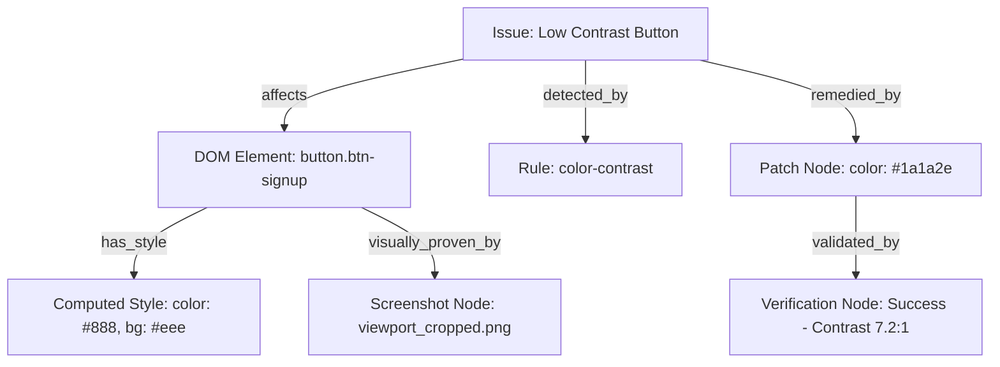

This structural link guarantees that when a developer reviews a report, they can click any issue and immediately see:
* The exact source code selector.
* The visual screenshot proof.
* The matching styling rule.
* The verified patch that fixes the issue.

---

# Part IX — Memory System

The memory module operates at three distinct levels of retrieval:

* **Short-Term Memory**: Session-specific context. Stores user actions, input variables, and traversed pages within the current audit run.
* **Project Memory (Middle-Tier)**: Stores database history of the current repository. Includes information about past issues, brand color rules, preferred fonts, and custom styling parameters.
* **Long-Term Memory (Global)**: High-dimensional vector database storing pairs of "Bug Description -> Successful Code Patch" collected across all projects, enabling cross-project learning.

---

# Part X — Reflection Engine

The Reflection Engine provides self-correction loop capabilities to the agent platform.

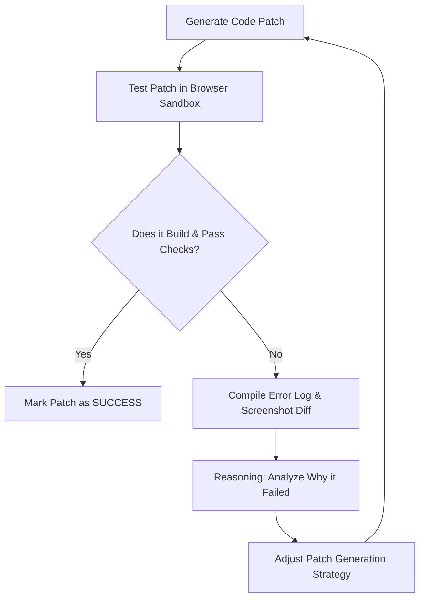

If a patch fails functional validation (e.g., causes a typescript syntax error or breaks adjacent layouts), the Reflection Engine collects the error log, feeds it back to the Patch Agent, and requests a corrected version (up to 3 retry attempts).

---

# Part XI — ML Architecture

To run locally and efficiently, the system architecture supports moving from public API wrappers to local custom models:

```text
+-----------------------------------------------------------------------+
|                            Next.js Server                             |
+-----------------------------------------------------------------------+
                                   |
                     (REST / IPC Microservice requests)
                                   v
+-----------------------------------------------------------------------+
|                       Python FastAPI ML Server                        |
|                                                                       |
|  +------------------------+             +--------------------------+  |
|  |   Florence-2 ONNX      |             |    Qwen-Coder 1.5B       |  |
|  |  (Visual UX Scan)      |             |     (Patch Generator)    |  |
|  +------------------------+             +--------------------------+  |
|                                                                       |
|  +------------------------+             +--------------------------+  |
|  |    BGE-Micro-v2        |             |     XGBoost Classifier   |  |
|  |    (Embeddings)        |             |    (Severity Predictor)  |  |
|  +------------------------+             +--------------------------+  |
+-----------------------------------------------------------------------+
```

Integrating these local models reduces runtime costs to zero, eliminates external network latencies, and keeps project source code secure.

---

# Part XII — Data Architecture

Below is the database relationship schema mapping our SQLite development and PostgreSQL production targets:

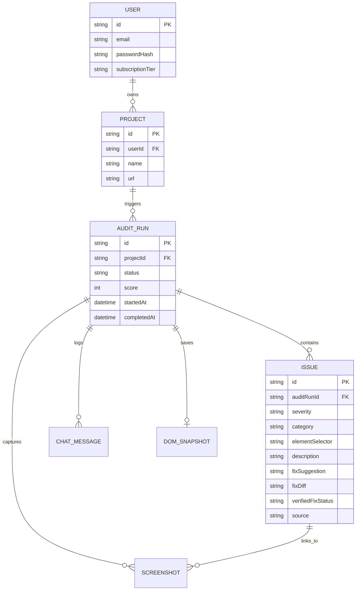

---

# Part XIII — Security

Auditing arbitrary external pages requires strict security controls:

* **Browser Sandbox**: Playwright instances run with `--disable-gpu`, `--no-sandbox`, and in isolated user-data directories.
* **Read-Only Permissions**: Agent processes do not have write access to the host file system except within designated temporary scratch directories.
* **Secrets Vault**: Environment variables containing external API keys or repository deployment tokens are encrypted at rest and only loaded into memory when executing associated tasks.
* **Credential Isolation**: If a mission requires logging into a website, credentials are submitted via secure browser input methods and never persisted in database logs.

---

# Part XIV — Scalability

To support concurrent audit requests, the backend architecture relies on:

* **Worker Pools**: Multi-process execution model using Node.js child processes or background tasks to run audits in parallel.
* **Browser Instance Recycling**: Playwright instances are recycled every 10 audits to prevent memory leaks and resource exhaustion.
* **Priority Queueing**: Missions are processed based on user tiers (`FREE` vs. `PRO`/`ENTERPRISE`), ensuring low latency for premium operations.

---

# Part XV — Sequence Diagrams

### 1. Website Audit Pipeline

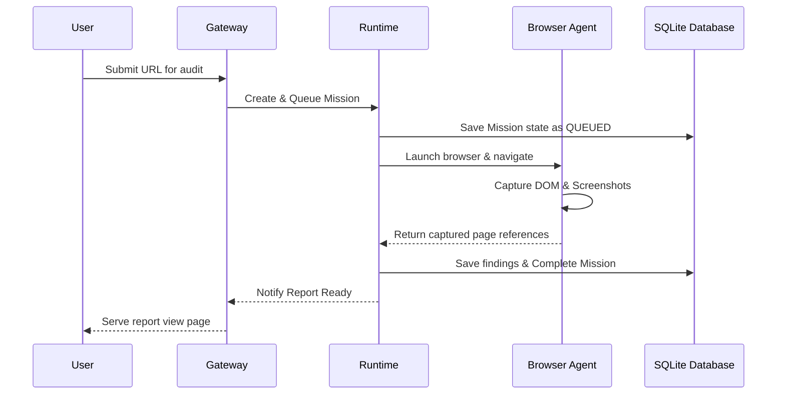

### 2. Patch Verification Flow

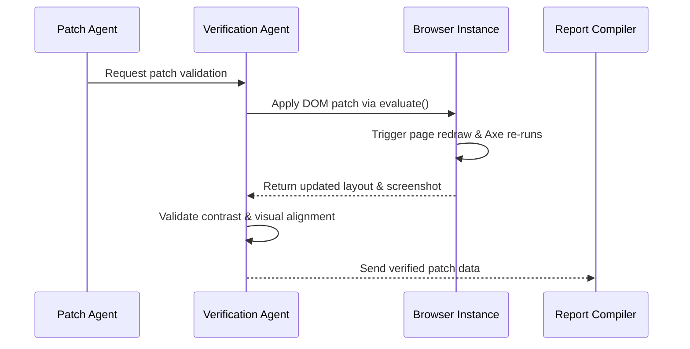

---

# Part XVI — Development Roadmap

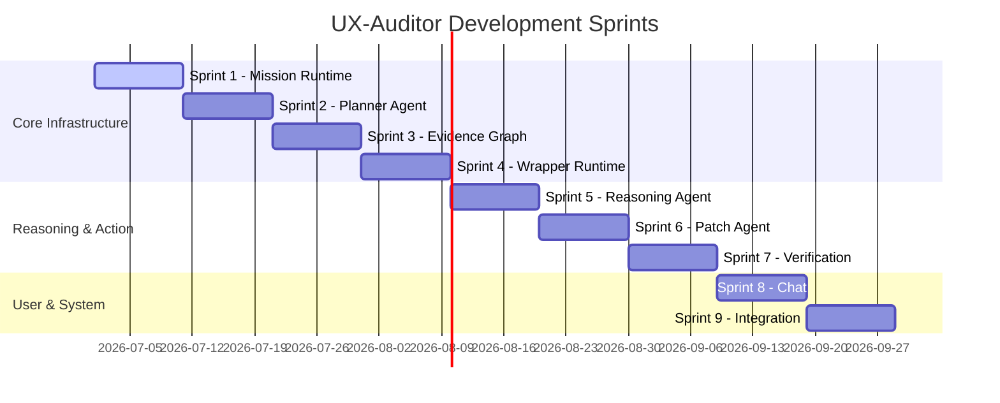


---

# Part XVII — Future Vision

The ultimate evolution of UX-Auditor is the **Autonomous UX Engineer**:

* **IDE Plugin (VS Code / Cursor)**: Highlights visual and contrast errors directly inside your working code editor and offers single-click code fixes.
* **GitHub PR Bot**: Automatically scans pull requests, launches a headless review, and pushes structural design improvements directly back to your branch.
* **CI/CD Quality Gate**: Blocks code merges if structural design elements (like buttons or navigation panels) fail alignment or contrast validation guidelines.
