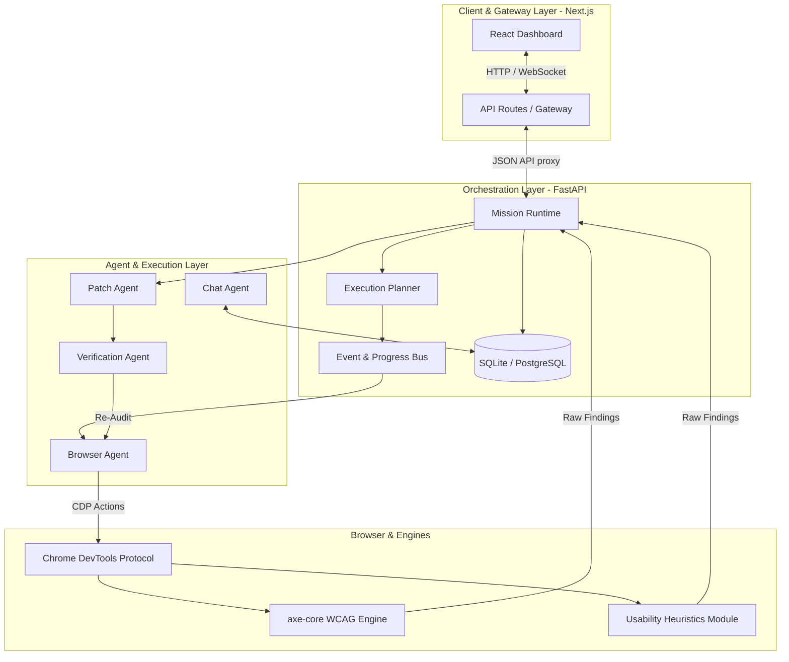
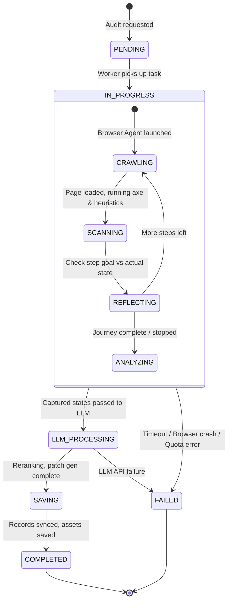
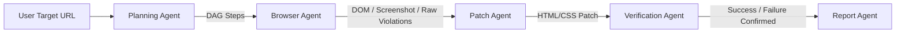
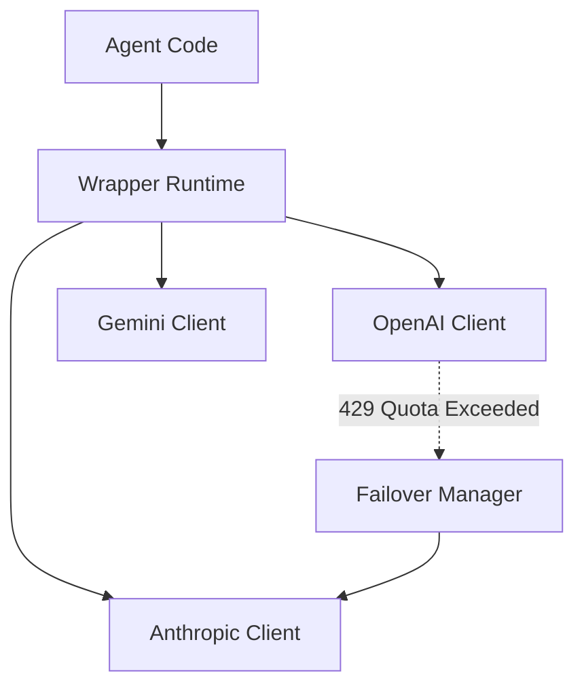
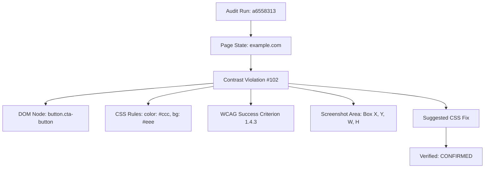
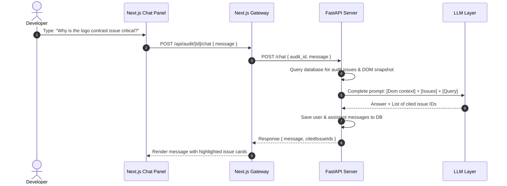

# UX-Auditor Agentic Architecture Design Document (AADD) v2.0

**Status**: Approved & Ready for Implementation  
**Author**: Principal Software Architect, Antigravity AI  
**Target Version**: Production MVP v2.0  
**Date**: June 2026  

---

## Part I — Vision

### 1. Executive Summary
Traditional web audit tools (e.g., Google Lighthouse, basic axe-core CLI runners) operate statically and in isolation. They scan a single DOM tree and output a laundry list of low-level violations, leaving developers to figure out how to reproduce them, how serious they actually are in context, and how to write fixes. 

**UX-Auditor** resolves this by moving from static scanning to **Agentic Auditing**. By combining LLM reasoning, deterministic engines (axe-core), custom heuristic collectors, and autonomous browser execution, UX-Auditor acts as an autonomous QA engineer. It:
1. **Navigates user journeys** interactively (e.g., "Add a product to cart and check out").
2. **Collects evidence** (DOM snapshots, contrast calculations, bounding box geometries, console logs, load timings) at every state change.
3. **Correlates findings** into a unified, graph-based representation called the **Evidence Graph**.
4. **Applies LLM-driven severity ranking** based on actual business and user experience impact.
5. **Generates verified patches** (HTML/CSS) to resolve usability and WCAG issues.
6. **Integrates Q&A** to let developers query the audit findings and ask for code modifications in natural language.

---

### 2. Design Philosophy

* **AI as an Operating System Capability**: The LLM is not just an API call; it is the orchestrator of browser actions, tool invocation, code generation, and verification.
* **Mission-Driven Architecture**: Audits are defined as "Missions" with clear objectives (e.g., "Verify the signup flow"). The agent plans, executes, reflects, and updates its strategy.
* **Autonomous Decision Making**: Rather than static scripts, the browser agent determines the best path to reach a page state or recover from navigations/crashes.
* **Evidence over Prompts**: All findings are grounded in immutable DOM nodes, coordinates, and screenshot coordinates to prevent hallucination.
* **Verification before Generation**: Every proposed code patch is applied to a sandbox DOM to verify that the violation is resolved without breaking visual structure.
* **Human-in-the-Loop by Choice**: Developers can run audits fully autonomously or interject to guide the agent or approve fixes.
* **Explainability First**: Every issue has a clear lineage linking it back to the exact DOM element, CSS rules, WCAG criteria, and LLM reasoning.

---

### 3. System Principles

* **Loose Coupling**: Frontend gateway, mission runtime, browser workers, and LLM reasoning layers are split into distinct, isolated modules communicating over typed JSON-RPC/REST.
* **Provider Agnostic AI**: Standardized wrapper interfaces allow swapping between OpenAI (GPT-4o), Anthropic (Claude 3.5 Sonnet), and Google (Gemini 1.5 Pro) with zero core changes.
* **Event-Driven Runtime**: System transitions, agent state changes, and findings are logged as system-wide events, making it easy to build real-time progress bars and websocket channels.
* **Self-Reflection & Continuous Learning**: The agent checks its own performance against the journey goal at every step, adapting if it gets stuck or encounters an error.

---

## Part II — Complete Architecture

### 4. High-Level Architecture

The UX-Auditor v2.0 architecture is divided into three key layers:
1. **Ingestion / Gateway Layer**: Next.js App acting as the client portal and API Gateway.
2. **Orchestration Layer (FastAPI)**: Manages the Mission Runtime, database, memory system, and event bus.
3. **Agent / Execution Layer**: Autonomous workers (Browser, Patch, Verification, and Chat agents) interacting with Playwright/CDP and the LLM wrappers.



---

### 5. Component Architecture

* **Gateway (Next.js)**: Handles user authentication, serves dashboard UI, routes requests to the FastAPI backend, and polls the FastAPI socket/API for progress events.
* **Mission Runtime (FastAPI)**: Generates unique `audit_id`s, manages the SQLite/PostgreSQL audit runs, schedules asynchronous background tasks, and manages active session locks.
* **Planner**: Decomposes the user's high-level goal into a directed acyclic graph (DAG) of browser tasks (e.g. `[Go to URL] -> [Fill Input] -> [Click CTA]`).
* **Browser Agent**: Controls Playwright/CDP, executes steps defined by the Planner, injects `axe-core.min.js`, runs heuristics, and takes base64 screenshots.
* **Patch Agent**: Takes target DOM snippets + CSS, identifies the root cause of the violation, and generates the corrected code (HTML/CSS diff).
* **Verification Agent**: Spins up an isolated browser page, injects the patch, and reruns the checks. If violations drop and styling holds, the patch is verified.
* **Chat Agent**: Takes user questions, retrieves audit issues and chat history from the DB, runs RAG against the DOM snapshots, and answers with code citations.

---

### 6. Folder Architecture

The production folder structure organizes frontend assets, FastAPI servers, agents, and local database scripts:

```text
ux-auditor/
├── prisma/
│   └── schema.prisma         # Next.js Prisma DB definitions (SQLite dev, PostgreSQL prod)
├── server/
│   ├── __init__.py
│   ├── main.py               # FastAPI web server, routes, middleware, and entrypoint
│   ├── db.py                 # SQLite local DB connection and schema migrations
│   ├── auditor.py            # browser-use Agent manager and step callback handler
│   ├── heuristics.py         # Usability heuristics engine (evaluated in-browser via CDP)
│   ├── llm_layer.py          # OpenAI/LLM completion prompts, patch generation, and chat Q&A
│   ├── requirements.txt      # Python package dependencies
│   └── .venv/                # Isolated python virtual environment
├── src/
│   ├── app/                  # Next.js App Router folders
│   │   ├── api/
│   │   │   ├── audit/
│   │   │   │   ├── route.ts         # Gateway audit starter (proxies to FastAPI /audit)
│   │   │   │   └── [id]/
│   │   │   │       ├── chat/        # Gateway chat endpoint (proxies to FastAPI /chat)
│   │   │   │       └── route.ts     # Gateway audit getter
│   │   │   └── auth/                # NextAuth session configuration
│   │   ├── dashboard/               # Frontend UI layouts
│   │   └── page.tsx                 # Landing page
│   ├── components/           # Glassmorphic React dashboard cards
│   ├── lib/                  # Prisma client initialization
│   └── styles/
├── .env                      # Unified environment credentials (API keys, DB URLs)
├── .gitignore                # Untracked files configuration
├── package.json              # Next.js node scripts
└── README.md
```

---

## Part III — Mission Runtime

### 7. Mission State Machine

A Mission represents a single end-to-end audit run. Its lifecycle is managed by an asynchronous worker that processes tasks and transitions state based on progress and error thresholds.



#### State Definitions
* **PENDING**: Job created in DB; awaiting scheduling.
* **CRAWLING**: Browser agent is navigating, clicking elements, or filling inputs.
* **SCANNING**: Gathering deterministic WCAG rules and computing tap target ratios, contrast values, and load times.
* **LLM_PROCESSING**: Invoking GPT-4o or Claude to deduplicate issues, evaluate UX impact (severity), and write HTML/CSS fixes.
* **COMPLETED**: Data successfully committed to SQLite/Prisma, screenshots saved, and webhook sent.
* **FAILED**: Audit stopped due to unrecoverable exception. Progress logs preserve the failure state for debugging.

---

## Part IV — Agent System

UX-Auditor v2.0 utilizes specialized agents that communicate using structured inputs/outputs.



### 8. Browser Agent
* **Purpose**: Execute browser steps, navigate interactive paths, and extract state context.
* **Inputs**: Target URL, optional journey steps.
* **Outputs**: Raw findings JSON list, screenshots (base64 encoded strings), raw HTML DOM snapshots.
* **Error Recovery**: If a page load fails (e.g. `ERR_CONNECTION_RESET`), the agent retries once with security flags disabled, then falls back to analyzing the last successful state.

### 9. Planning Agent
* **Purpose**: Map high-level human requirements (e.g., "Add the item to the cart") into actionable locator targets.
* **Workflow**:
  1. Inspect the layout of the page.
  2. Locate elements matching CTA semantics.
  3. Emit a structured action sequence (`type`, `click`, `scroll`, `wait`).

### 10. Patch Agent
* **Purpose**: Write clean, standards-compliant HTML/CSS fixes for accessibility and usability failures.
* **Prompt Structure**:
  ```text
  You are an expert Frontend Developer.
  Given this violated HTML snippet: [Violated HTML]
  And this WCAG Violation: [Violation Detail]
  Generate a drop-in replacement that fixes the issue while preserving visual identity.
  Return JSON: { "original": "...", "fixed": "...", "css_override": "..." }
  ```

---

## Part V — Wrapper Runtime

To prevent API key exposure and manage model failovers, all LLM calls pass through a unified Wrapper Runtime.



### 11. API Specifications

```python
class LLMWrapper:
    @staticmethod
    async def generate_completion(
        system_prompt: str,
        user_prompt: str,
        temperature: float = 0.0,
        model_preference: str = "gpt-4o"
    ) -> str:
        """
        Executes LLM completions with fallback handlers.
        If OpenAI returns a quota error, it automatically falls back to Claude/Gemini.
        """
        # 1. Attempt Primary Provider
        try:
            if model_preference == "gpt-4o":
                return await LLMWrapper._call_openai(system_prompt, user_prompt, temperature)
        except Exception as e:
            if "quota" in str(e).lower() or "429" in str(e):
                print("OpenAI quota exceeded. Failing over to Anthropic Claude...")
                return await LLMWrapper._call_anthropic(system_prompt, user_prompt, temperature)
            raise e
```

---

## Part VI — Event-Driven Runtime

All transitions in the audit lifecycle are published to an in-memory event queue in FastAPI. The gateway listens to this queue to deliver real-time progress updates.

| Event Type | Producer | Consumers | Payload Schema |
| :--- | :--- | :--- | :--- |
| `AUDIT_STARTED` | Mission Runtime | Gateway, DB | `{ "audit_id": "uuid", "url": "string" }` |
| `STEP_COMPLETED` | Browser Agent | Event Bus | `{ "audit_id": "uuid", "step": 2, "url": "string" }` |
| `ANALYSIS_COMPLETE`| Heuristics/Axe | Patch Agent | `{ "audit_id": "uuid", "issues_count": 12 }` |
| `PATCH_GENERATED` | Patch Agent | Verify Agent | `{ "issue_id": "string", "diff": "string" }` |
| `AUDIT_SUCCESS` | Report Agent | Gateway, DB | `{ "audit_id": "uuid", "findings_summary": "..." }` |
| `AUDIT_FAILED` | Mission Runtime | Gateway, DB | `{ "audit_id": "uuid", "error": "string" }` |

---

## Part VII — Analysis Engine

UX-Auditor combines automated standards checks with custom human-centric heuristics:

```text
                  +--------------------------------+
                  |  Interactive Page State (CDP)   |
                  +---------------+----------------+
                                  |
            +---------------------+---------------------+
            |                                           |
            v                                           v
+-----------------------+                   +-----------------------+
|   axe-core Engine     |                   |  Heuristics Engine    |
|  (Standard Standards) |                   |  (Usability Rules)    |
|                       |                   |                       |
|  - Keyboard traps     |                   |  - Contrast ratios    |
|  - Aria labels        |                   |  - Click-depth ctas   |
|  - Table styling      |                   |  - Touch-target sizes |
|  - Headings hierarchy |                   |  - Load event timings |
+-----------+-----------+                   +-----------+-----------+
            |                                           |
            +---------------------+---------------------+
                                  |
                                  v
                  +--------------------------------+
                  |    Unified Finding Structure   |
                  +--------------------------------+
```

---

## Part VIII — Evidence Graph

Rather than flat JSON logs, audit findings are stored in an **Evidence Graph**. This maintains strict lineage, allowing the QA engineer or chat bot to explain why a particular patch was generated.



---

## Part IX — Memory System

The agent utilizes a segmented memory layout to handle long journeys and improve future recommendations:

1. **Short-Term Memory (Context Window)**: Preserves active DOM structures, clicked locators, and current page navigation states.
2. **Mission Memory (Session Logs)**: Maintained in the SQLite `progress_logs` database to allow resuming audits if the process restarts.
3. **Long-Term Memory (Knowledge Base)**: Vector representations of common design framework components (Tailwind, Bootstrap) and past verified fixes.

---

## Part X — Reflection Engine

At the end of every step, the Browser Agent performs a **Self-Correction Check**:

```text
[Step End] -> Read Target Goal -> Inspect Current Page URL -> [Has URL changed / page loaded?]
                                                                    |
                                           +------------------------+------------------------+
                                           | Yes                                             | No (Stuck/Error)
                                           v                                                 v
                                   [Proceed to Next Step]                         [Inject Exploration Nudge]
                                                                                  -> Clear cookies/cache
                                                                                  -> Attempt back navigation
                                                                                  -> Trigger secondary click
```

---

## Part XI — Data Architecture

UX-Auditor uses SQLite for local fast execution and is fully migration-ready for PostgreSQL.

### Database Schema (Prisma)

```prisma
datasource db {
  provider = "sqlite"
  url      = env("DATABASE_URL")
}

model Project {
  id        String     @id @default(uuid())
  url       String
  createdAt DateTime   @default(now())
  audits    AuditRun[]
}

model AuditRun {
  id           String        @id @default(uuid())
  projectId    String
  project      Project       @relation(fields: [projectId], references: [id])
  status       String        // PENDING, IN_PROGRESS, COMPLETED, FAILED
  journeySteps String?
  createdAt    DateTime      @default(now())
  issues       Issue[]
  screenshots  Screenshot[]
  domSnapshot  DomSnapshot?
  chatMessages ChatMessage[]
}

model Issue {
  id          String   @id @default(uuid())
  auditRunId  String
  auditRun    AuditRun @relation(fields: [auditRunId], references: [id])
  selector    String
  description String
  severity    String   // Critical, Serious, Moderate, Minor
  impact      String?
  patchCode   String?
  fixDiff     String?  // JSON string showing before/after code blocks
  screenshotUrl String?
}

model Screenshot {
  id         String   @id @default(uuid())
  auditRunId String
  auditRun   AuditRun @relation(fields: [auditRunId], references: [id])
  stepIndex  Int
  imageUrl   String   // Base64 encoded or file path
}

model DomSnapshot {
  id         String   @id @default(uuid())
  auditRunId String   @unique
  auditRun   AuditRun @relation(fields: [auditRunId], references: [id])
  html       String
}

model ChatMessage {
  id            String   @id @default(uuid())
  auditRunId    String
  auditRun      AuditRun @relation(fields: [auditRunId], references: [id])
  sender        String   // user, assistant
  message       String
  citedIssueIds String   // JSON string of array of issue IDs
  createdAt     DateTime @default(now())
}
```

---

## Part XII — Sequence Diagrams

### 12. End-to-End Audit Run

```mermaid
sequenceDiagram
    autonumber
    actor Dev as Developer
    participant UI as Next.js Dashboard
    participant API as Next.js Gateway
    participant Server as FastAPI Server
    participant Agent as Browser Agent
    participant Playwright as Playwright Browser
    participant LLM as LLM Layer (GPT/Claude)

    Dev->>UI: Enter Target URL & Journey Steps
    UI->>API: POST /api/audit { url, journey }
    API->>Server: POST /audit { url, journey }
    Server-->>API: 200 OK { audit_id, status: PENDING }
    API-->>UI: Redirect to /audit/[id] (polling starts)
    
    rect rgb(30, 30, 50)
        Note over Server, Playwright: Background Worker Executing
        Server->>Agent: Initialize Browser & Connect
        Agent->>Playwright: Launch Headless Browser (CDP)
        Playwright->>Playwright: Navigate to URL
        Agent->>Playwright: Inject axe-core & Run Heuristics
        Playwright-->>Agent: Raw JSON findings & base64 screenshot
        Server->>Server: Save progress logs
    end

    Server->>LLM: Rerank issues & Generate HTML/CSS Patches
    LLM-->>Server: Ranked issues with fix diffs
    Server->>Server: Commit AuditRun to DB (Prisma sync)
    
    UI->>API: GET /api/audit/[id] (polling)
    API->>Server: GET /report/[id]
    Server-->>API: 200 OK { status: COMPLETED, issues, etc. }
    API-->>UI: Render glassmorphic issue cards
```



---

### 13. Conversational QA Sequence



---

## Part XIII — Sandbox & Security

1. **Browser Sandboxing**: The Playwright instance runs inside Chromium with `--no-sandbox` disabled, utilizing isolated namespaces to prevent host system escapes.
2. **Security Controls**:
   * Cross-domain request restrictions are relaxed (`disable_security=True`) *only* inside the headless browser container to allow the heuristics module to crawl local styles.
   * Host credentials (e.g., system env files) are never read or passed to LLM prompts.
3. **Audit Token Isolation**: Each run creates a fresh, ephemeral browser profile directory that is deleted from storage immediately upon `browser.close()`.

---

## Part XIV — Scalability

* **Task Queue**: Background audits use FastAPI's `BackgroundTasks`. For production scaling, this transitions directly to Celery + Redis.
* **Ephemeral Profiles**: By avoiding persistent global browser context locks, multiple audits run concurrently on the same server, limited only by host memory.
* **Static Assets**: Screenshots are converted to base64 strings or written to local storage, which can be easily mapped to S3/Cloudinary in the production build.

---

## Part XV — Development Roadmap

* **Phase 1: Basic Audit Engine (Completed)**: Core axe-core + usability heuristics modules, SQLite DB models, and initial FastAPI setup.
* **Phase 2: Next.js Gateway Proxy (Completed)**: Seamless API endpoint proxying and synchronized SQLite databases.
* **Phase 3: Sandbox Verification & Failovers (In Progress)**:
  * Integrate multi-provider LLM failovers (OpenAI to Claude/Gemini).
  * Build the patch verification worker.
* **Phase 4: SaaS Deployment (Next)**: Migrate local SQLite databases to Supabase PostgreSQL, move background workers to Celery, and launch the platform.
